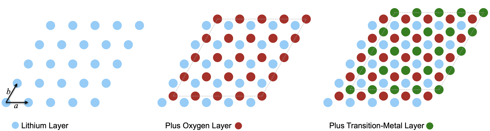
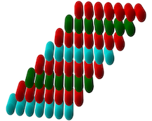

# NMC Anneal python package

## Purpose:
Package generates potential trial structures for layered Nickel-Manganese-Cobalt (often called  Li-NMC, LNMC, NMC, or NCM) battery cathodes using a simple charge-balancing energy calculation. Any stoichiometry of transition metals and vacancies in both the lithium layer and the transition-metal layer can be modeled.

This code represents an expansion of the method published in *Structure Solution of Metal-Oxide Li Battery Cathodes from Simulated Annealing and Lithium NMR Spectroscopy* K. J. Harris, J. M. Foster,  M. Z. Tessaro, M. Jiang, X. Yang, Y. Wu, B. Protas, and G. R. Goward *Chem. Mater*. 29, 5550−5557, **2017**.  The NMC_anneal package uses the same basic energy equation but expands the model to three dimensions and includes the ability to study delithiated (charged) versions of any structure.

## Overview of model
The layered structures are represented internally as a 3D NumPy array. The energy equation is defined as the local charge balance around each oxygen atom (defined as a minimum energy when each -2 oxygen is surrounded by +2 charge from surrounding metals). This energy equation is employed in a simulated annealing algorithm that moves metal atoms around within a layer using an artificial "temperature" parameter to mimic the thermal disorder these types of samples are synthesized with. The user defines the stoichiometry of each layer, annealing parameters such as temperature and number of steps, and has options to visualize the results of these runs. Optionally, the user can choose to charge the cathode by selecting one of the possible models for TM oxidation and specifying an amount to delithiate. Note that lithium atoms are very mobile, so these are moved to the lowest energy positions instead of employing an annealing temperature.

## Basic usage

#### Setting control parameters

Most of the fine grained detail of the model are defined via a structured text file with keywords. Example:

```
# Lattice
width = 12
n_layers = 8

#Li layer Composition
li_fraction_li_layer = 1.00
mn_fraction_li_layer = 0.00
ni2_fraction_li_layer=0.0
ni3_fraction_li_layer=0.0
vac_fraction_li_layer=0.0

# TM layer Composition
li_fraction_tm_layer=0.
mn_fraction_tm_layer=0.3333
ni2_fraction_tm_layer=0.3333
ni3_fraction_tm_layer=0.
co_fraction_tm_layer=0.3333
vac_fraction_tm_layer=0.0

#Lattice initialization by annealing TM layer
initialize_anneal_steps = 1e5
initialize_anneal_hot_temp = 0.2
initialize_anneal_cold_temp = 0.06

# Electrochemistry
delithiation_steps = 1.5e3
delithiation_fraction_to_remove = 0.20
oxidation_model = ni_2to4

#Lattice mid-delithiation annealing
mid_delithiation_anneal_steps=1e4
mid_delithiation_anneal_hot_temp=0.0
mid_delithiation_anneal_cold_temp=0.0

# Output
output_file = lattice_final.npy
```
 <br />
 <br />
 
 #### Example initialization and annealing
An initial random structure can be generated with the initialize_lattice() function at the stoichiometry defined in an input text file, and those random TM positions can then be annealed.
 
 


```python

#Load stoichiometry
config = nmc.parse_input_file(Path("input.txt"))

#Initialize lattice with random metal positions (dual arrays, one with atomic charges and one with their names):
whole_lattice_species, whole_lattice_charges = nmc.initialize_lattice(config)

#Anneal structure:
nmc.anneal_3Dlattice(
        config,
        whole_lattice_charges,
        whole_lattice_species,
        anneal_type="Initialize TM",
        graph_energy=False,
    )
```
<br />
<br />

#### Checking for convergence
The number of steps required depends on the atoms present as well as the size of lattice chosen. To get some insight into when the simulation has reached ergodicity, use the convergence plotting tool to trace the average energy of the system vs the number of steps in the simulation.

```python
 nmc.find_and_plot_convergence(
        config,
        whole_lattice_charges,
        whole_lattice_species,
        output_filename="energy_convergence.pdf",
        anneal_type="TM Convergence Check",
        max_n_steps=1e7,
        sim_hot_temp=1.0,
        sim_cold_temp=0.0,
        fraction_max_steps_list=[0.00001, 0.0001, 0.001, 0.01, 0.1, 1],
    )
```
Results:

<br />
<br />
#### Observing phase transitions
Since the real world versions of these materials are generally quickly quenched from their high synthesis temperature, one is generally interested in tracking the behavior at different levels of disorder. It can be useful to generate a phase diagram with:
```python
   nmc.get_phase_diagram(
        config,
        whole_lattice_charges,
        whole_lattice_species,
        output_filename="phase_diagram.pdf",
        anneal_type="TM Convergence Check",
        n_steps_perT=1e4,
        sim_start_temp=0,
        sim_end_temp=3,
    )

```
Results:


<br />
<br />

## Implementation Details and Structure Conventions

The chemical structure of layered NMC cathodes consists of alternating 2D sheets of transition metals alternating with 2D sheets of lithium atoms. These metal layers are separated by oxygen sheets. The oxygen sheets do not change in any across different stoichiometries or charge levels, so these are not represented internally. Calculations instead refer to virtual oxygen layers with the same structure for book-keeping purposes.


The structure is represented internally as a stack of 2D arrays. Layer 0 is lithium, layer 1 transition metal, and so on.  This stack is stored as a 3D NumPy array with the 0th axis being the stacking axis. To speed up math on the charge checks while also tracking any cases where multiple metals have the same charge, a dual array is used. One with the atomic charges and one with the names of the ions.

Ignoring vacancies and mixtures of TMs, the structure of these lattices is a simple FCC closest packing of spheres (see https://en.wikipedia.org/wiki/Close-packing_of_equal_spheres). In FCC, the layers stack with a repeating ABC, ABC, ABC, etc. order with, with each layer is shifted over 0.5 units along both the *a* and *b* directions (∠ *a*,*b* = 60 °). The third layer is shifted the same amount/direction. The first three layers therefore look like:


<br />

The shift from the third layer to the fourth layer is such that the atomic positions overlay exactly with the positions of layer one. However, the code here uses the convention that the fourth layer of the periodic cell is diagonally shifted from layer one.  Therefore the bottom left atom of every layer depicted above is at index (L, a=0, b=0). Geometrically, index 0,0 of layer 1 is shifted +1*a*, +1*b* from the atom at index 0,0 of layer 0. This choice of unit cell means that every layer in a large stack are connected to the layers above/below in the exact same way, and nearest-neighbor calculations are very easily made periodic with modular arithmetic.  While the structure is stored as a 3D Numpy array that looks square, it represents a tilted parallelogram:
 
 
 <br />
 <br />

The oxygen layers are chemically immutable, so there is no need to store them. However, bookkeeping requires a convention to refer to them for calculating nearest neighbors. Here, we use as a convention that oxygen-layer-0 is *between* metal-layer-0 (lithium layer) and metal-layer-1 (TM layer); i.e., oxygen layer 0 is physically between the metal layers desribed by [0,:,:] and [1,:,:] of the NumPy array. This means that every metal layer at vertical index *l* is sandwiched between oxygen layers with index (*l*-1) and (*l*), subject to periodicity when needed.

Energy is here defined in terms of the oxygen atoms:
(1) Each oxygen prefers a net +2 from the 6 metals surrounding it.
(2) Each of those 6 metals has 5 *other* oxygens, so 1/6th of the charge of each neighboring metals contributes to the charge balance of a particular oxygen atom
Therefore, the total energy equation is the average of all the oxygen atoms in the structure.

Index shifts for nearest-neighbor oxygen atoms are coded explicitly in energy_calculations.py. Index shifts for the nearest-neighbor metals within a layer or in the layer above and below (those sharing an oxygen atom) are explicitly coded in charging_methods.py.

## Planned Features

### Analysis methods:
- More oxidation methods
- Pair distribution functions (from diffraction data)

