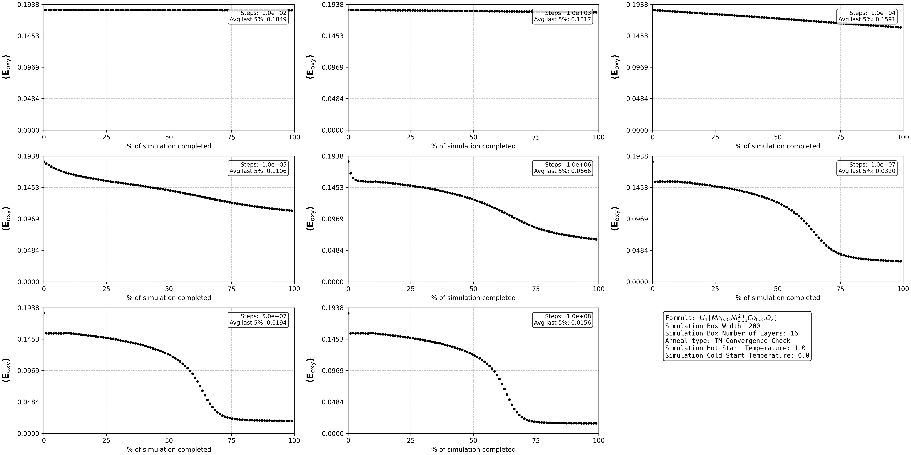
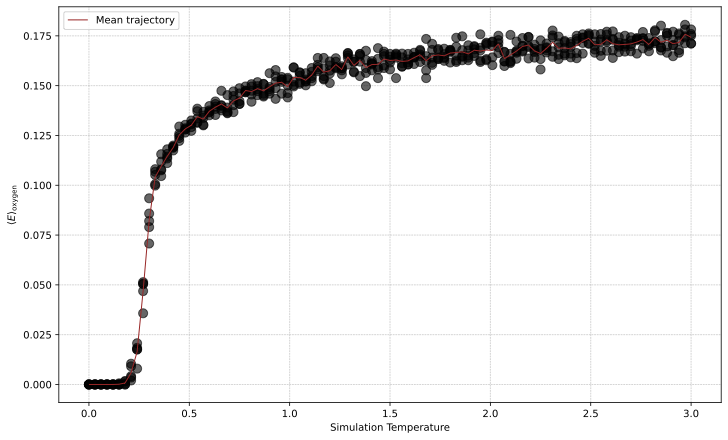
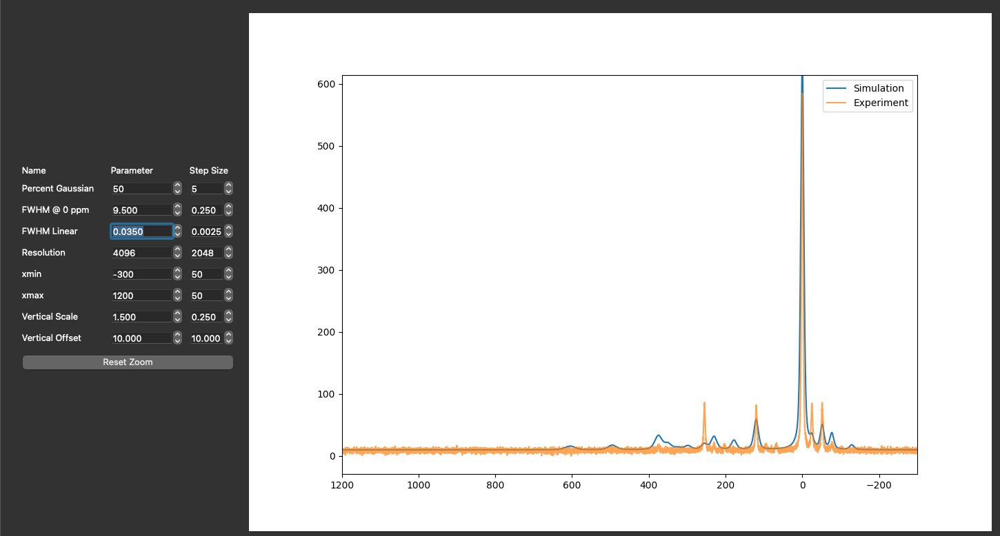

# Example Workflows

Complete examples are available in the examples/ directory.

## Building the Simulation

The system to be modelled and most of the simulation parameters are defined in an input text file with a keyword = value style.

Example:
```txt
# Lattice
width = 12
n_layers = 8   #Set this to the number of available CPU cores for maximum parallel computation efficiency

#Li layer Composition
li_fraction_li_layer = 1.00
mn_fraction_li_layer = 0.00
ni2_fraction_li_layer=0.0
ni3_fraction_li_layer=0.0
vac_fraction_li_layer=0.0

# TM layer Composition
li_fraction_tm_layer=0.
mn_fraction_tm_layer=0.3333
ni2_fraction_tm_layer=0.3333
ni3_fraction_tm_layer=0.
co_fraction_tm_layer=0.3333
vac_fraction_tm_layer=0.0

#Lattice initialization by annealing TM layer
initialize_anneal_steps = 1e5
initialize_anneal_hot_temp = 0.2
initialize_anneal_cold_temp = 0.06

# Electrochemistry
delithiation_fraction_to_remove = 0.20
oxidation_model = ni_2to4

#Lattice mid-delithiation annealing
mid_delithiation_anneal_steps=1e4
mid_delithiation_anneal_hot_temp=0.0
mid_delithiation_anneal_cold_temp=0.0

# Output
output_file = lattice_final.npy
```

## Basic Initialization and Annealing Simulation

```python

#Load stoichiometry
config = nmc.parse_input_file(Path("input.txt"))

#Initialize lattice with random metal positions (dual arrays, one with atomic charges and one with their names):
whole_lattice_species, whole_lattice_charges = nmc.initialize_lattice(config)

#Anneal structure:
nmc.anneal_3Dlattice(
    config,
    whole_lattice_charges,
    whole_lattice_species,
    anneal_type="Initialize TM",
    graph_energy=False,
)
```

## Checking for Convergence
The number of steps required depends on the atoms present as well as the size of lattice chosen. To get some insight into when the simulation has reached ergodicity, use the convergence plotting tool to trace the average energy of the system vs the number of steps in the simulation.

Example:
```python
nmc.find_and_plot_convergence(
    config,
    whole_lattice_charges,
    whole_lattice_species,
    output_filename="energy_convergence.pdf",
    anneal_type="TM Convergence Check",
    max_n_steps=1e7,
    sim_hot_temp=1.0,
    sim_cold_temp=0.0,
    fraction_max_steps_list=[0.00001, 0.0001, 0.001, 0.01, 0.1, 1],
)
```
Results:


## Observing Phase Transitions
Since the real world versions of these materials are generally quickly quenched from their high synthesis temperature, one is generally interested in tracking the behavior at different levels of disorder. It can be useful to generate a phase diagram with:
```python
nmc.get_phase_diagram(
    config,
    whole_lattice_charges,
    whole_lattice_species,
    output_filename="phase_diagram.pdf",
    anneal_type="TM Convergence Check",
    n_steps_perT=1e4,
    sim_start_temp=0,
    sim_end_temp=3,
    )
```
Example:


## Electrochemical Delithiation
The amount of lithium atoms (and corresponding electrons) to remove are specified as a fraction of the empirical chemical formula using the "frac_li_to_remove" argument to the delithiate() function.  Three models for the oxidation steps are provided for testing, and one must be specified in the input text file (stored in the SimulationConfig object).
* Ni2+ directly to Ni4+ (and then followed by Co3 if at extremely high capacity). Oxidation model = "ni_2to4_co_3to4".
* Ni2+ to Ni3+, and then once complete, Ni3+ directly to Ni4+ begins (and Co3+ if needed). Oxidation model = "ni_2to3_ni_3to4_co_3to4".
* Ni2+ to Ni3+, and then once complete, EITHER Ni3+ directly to Ni4+ or Co3+ to Co4+ according to oxygen energy at each atomic step. Oxidation model = "ni_2to3_any_3to4".
This model is

Example:

```python
import nmc_anneal.core.charging_methods as cm

cm.delithiate(
    config,
    whole_lattice_charges,
    whole_lattice_species,
    frac_li_to_remove = 0.250,
)
```

## <sup>7</sup>Li NMR Spectra
The chemical shift in ppm for each type of neighboring metal atom must be specified using a dict. The function nmr_ppm_shifts() generates a dual array with the intensities and their positions (in ppm). 

Example:
```python
from nmc_anneal.analysis.struct2nmr import get_all_nmr_shifts

nmr_shifts_dict_90s = {
        "Mn": 255,
        "Ni2+": -25,
}

nmr_shifts_dict_180s = {
    "Mn": -52,
    "Ni2+": 120,
}

nmr_ppm_shifts = get_all_nmr_shifts(
    whole_lattice_charges,
    whole_lattice_species,
    nmr_shifts_dict_90s,
    nmr_shifts_dict_180s,
)
```

The digital list of peak positions can be converted to a full NMR spectrum by passing that list and lineshape parameters to image_from_peaklists(). Note that the percent Gaussian vs Lorentzian must be specified as well as the full linewidth at half maximum (fwhm). Optionally, it is possible to have linewidths increase as the peaks become paramagnetically shifted further from 0 ppm by setting the the linear scale variable to a value other than 0. 

Example:
```python
image_from_peaklist(
    data=nmr_ppm_shifts,
    percent_gaussian=50,
    fwhm_at_zero=3,
    fwhm_linear_scale=0.0,
    output_filename="examples/nmr_simulation.png",
    n_points=4192,
    xmin=-300,
    xmax=1000,
)
```

You can also iteratively adjust the linewidth parameters through comparison to an experimental spectrum (stored as a numpy arrays for intensity and axis) using the gui run_peak_gui():

```python
import nmc_anneal.viz.nmr_gui as NMRplot

data = np.load("examples/artifical_experimental_7LiNMR.npz")
exp_ppm_axis = data["ppm_axis"]
exp_intensities = data["intensities"]

datasets = {
    "Simulation": (nmr_ppm_shifts[0], nmr_ppm_shifts[1]),
    "Experiment": (exp_ppm_axis, exp_intensities),
}

NMRplot.run_peak_gui(datasets)
```
Interface:
